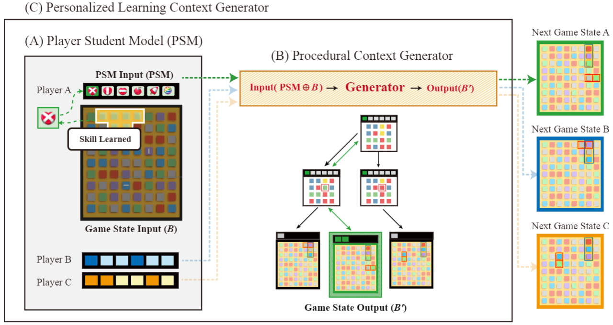

# Personalized-Tutorial-Generation
Official implementation of the paper "Personalized In-game Tutorial Generation through Incorporation of
Procedural Context Generator with Player Student Model" (Under Review) 

## Abstract


The abstract discusses the underdeveloped state of game tutorials in artificial intelligence and introduces a personalized in-game tutorial generation method. This method utilizes procedural content generation and student modeling to consider individual player learning abilities and prior knowledge. The study, involving 89 participants, demonstrates that the personalized tutorial generator significantly improves players' learning of game mechanics by an average of 68.3% within a short tutorial time. The generator, operating without player awareness, enhances tutoring effects during natural gameplay.

## Demonstrations
Herein, there are three comparisons for the tutorial generation. Note that the generation algorithm works on the transition of the game state and it is unaware from the player's perspective.
With the below demonstrations, you can compare the tutorial generation has capable of improving the player's learning of game mechanics.
The personalized tutorial generation has capable of capturing your learning progress and generating the tutorial contents based on your knowledge status.

The text label on the top-left corner of the game scene indicates the generator type and the currently estimated player knowledge state.
Note that the label is not visible in the user study experiment.

| Generator | Description                                                                                                         | Demo       |
|-----------|---------------------------------------------------------------------------------------------------------------------|------------|
| `Random`  | Generates random elements with no specific algorithm. The logic of the game transtion is same to the original game. | [Demo URL]() |
| `MCTS-GEN`| Applies Monte Carlo Tree Search for the learning context generation without the player knowledge state.             | [Demo URL]() |
| `MCTS-PSM`| Applies Monte Carlo Tree Search for the learning context generation with the player knowledge state.                | [Demo URL]() |


## Directory Structure
```
(Project Dir)                                                                         
├─Experiment
│  ├─ProxyPlayer (Experiment 1: Agent-based playtesting analysis files)
│  │  ├─generated (experiment configurations for simulation)
│  └─UserStudy (Experiment 2: Agent-based playtesting analysis files)
├─Project
│  ├─Assets
│  │  ├─ML-Agents
│  │  │  ├─Examples
│  │  │  │  ├─Match3 
│  │  │  │  │  ├─Logs (Result files for experiment 1)
│  │  │  │  │  ├─Prefabs (Resource files for user study)
│  │  │  │  │  ├─Resources (Resource files for user study)
│  │  │  │  │  ├─Scenes
│  │  │  │  │  │  ├─Match3.unity (Simualtion scene for experiment 1)
│  │  │  │  │  │  ├─Match3Web.unity (User study scene for experiment 2)
│  │  │  │  │  ├─Scripts (MCTS, GA-based tutorial generation scripts, and crowdsourcing log collecting scripts)
│  │  │  │  │  │  ├─BoardPCGAgent.cs (Agent script of fast simulation for experiment 1)
│  │  │  │  │  │  ├─BoardManualAgent.cs (Agent script of playable scene for experiment 2)
│  │  ├─StreamingAssets (Quiz levels for evaluation the human player on experiment 2)
│  ├─Build
│  ├─Packages
│  ├─ProjectSettings
```

## Experiments
### Experiment 1: Agent-based Playtesting Analysis
```bash
bash ./Experiment/ProxyPlayer/run_experiment_automated.sh
```
The collected data is located in `Project/Assets/ML-Agents/Examples/Match3/Logs/`. The data is collected from the simulation of the game scene.  
The log data is analysised with the jupyter notebook. The analysis notebook is located in `Experiment/ProxyPlayer/analysis.ipynb`. 


### Experiment 2: User Study
The user study is conducted on the web browser. The user study scene is located in `Project/Assets/ML-Agents/Examples/Match3/Scenes/Match3Web.unity`. 
The game scene is compiled with WebGL and published via Github pages and the game log data is collected via [Google Firebase](https://firebase.google.com/).

Please change `[Firebase-Project-Name]` string to your own Firebase project name in `Project/Assets/ML-Agents/Examples/Match3/Scripts/FirebaseLogger.cs`
```csharp
public class FirebaseLogger: MonoBehaviour
{
    // Start is called before the first frame update
    private const string FirebaseUrl = "https://[Firebase-Project-Name].firebaseio.com/0824/{playerId}/";
    private const string LearningSessionUrl = "Learning.json";
    private const string QuizSessionUrl = "Quiz.json";
    private const string DoneUrl = "Done.json";
   ...
```

The log data is analysised with the jupyter notebook after download the `output.json` from the database. The analysis notebook is located in `Experiment/UserStudy/analysis.ipynb`.

## License
This project is licensed under the MIT License - see the [LICENSE](LICENSE) file for details.

# Disclaimer
The match-3 game project is developed by [Unity Technologies](https://unity.com/).
The game is modified for the purpose of this study. The original game can be found [here](https://github.com/Unity-Technologies/ml-agents/tree/develop/Project/Assets/ML-Agents/Examples/Match3/Scenes).

